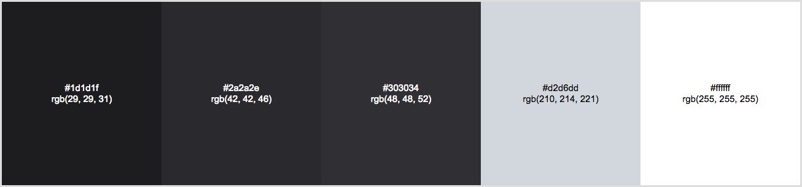
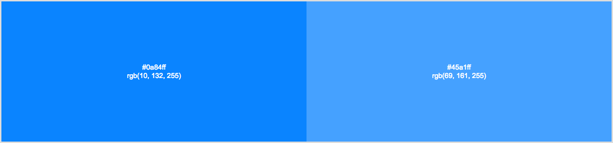
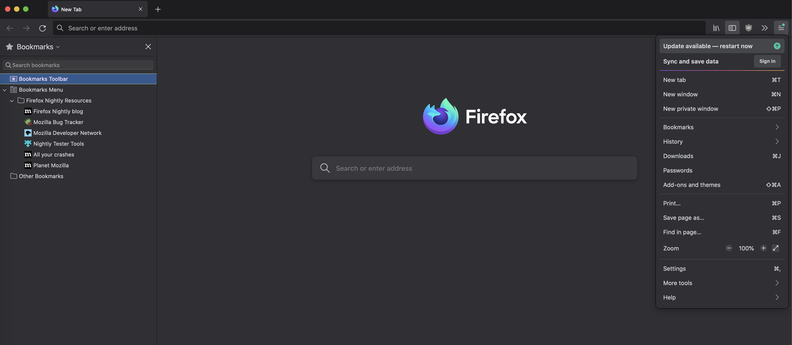

# Dark Developer Theme (WebExtension)

Firefox dark theme inspired by the Developer Tools color palette

## Color Palette

### Main colors

### Secondary colors

## Screenshots

## License

[Creative Commons Attribution 3.0](https://creativecommons.org/licenses/by/3.0/)
